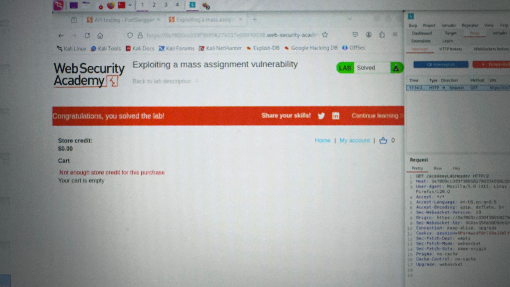

 # Lab: Exploiting a Mass Assignment Vulnerability

📍 **Platform:** PortSwigger Web Security Academy  
📅 **Date Completed:** March 1, 2025  
🎯 **Objective:** Identify and exploit a mass assignment vulnerability to perform unauthorized product purchases.  
✅ **Status:** Successfully completed

---

## 🧠 Overview

This lab demonstrates a common web application vulnerability known as **mass assignment**. Demonstrates how improper handling of object-level permissions in APIs can be abused. Specifically, we target a hidden chosen_discount field in the backend API request — not exposed by the frontend — and inject it to trick the server into giving us a 100% discount.

---

## 🔍 Detailed Methodology

### 🔐 1. Logged into the Application

- Accessed the provided lab instance on PortSwigger.
- Used the default test credentials:
  Username: wiener
  Password: peter
  Logged in as a normal user
  
### 🛒 2. Navigated to Product Purchase Page

- Selected the product: **Lightweight l33t Leather Jacket**.
- Initiated a normal purchase attempt through the frontend by adding the product to cart
- Tried to place an order
- Clicked "Place order" in the basket.
- Got a message saying insufficient credit to buy the product..

### 🎯 3. Inspected the HTTP requests using Burp Suite

- In Proxy > HTTP history, found:
- A GET /api/checkout request
- A POST /api/checkout request
- The GET response showed a field called chosen_discount (it wasn't there in the POST body).

 
### 🔍 4.  Sent the POST request to Repeater and modified it

- Added this to the body:
- {
  "chosen_discount": {
    "percentage": 0
  },
  "chosen_products": [
    {
      "product_id": "1",
      "quantity": 1
    }
  ]
}
- Sent the request — no error, which meant the server accepted the field.

### 📦 5. Tested further to confirm server behavior

- Changed percentage to "x" and resent — got an error.

- This confirmed the server was processing the discount value.

### ✅ 6. Confirmed Exploit & Lab Completion
- Updated the discount to 100:
- {
  "chosen_discount": {
    "percentage": 100
  },
  "chosen_products": [
    {
      "product_id": "1",
      "quantity": 1
    }
  ]
}
- Sent it — 💥 Order went through successfully with 100% discount!

### 🛠️ Tools & Technologies Used

Burp Suite — for intercepting and modifying HTTP requests.

JSON crafting – to inject hidden parameters manually.

Logic testing – to confirm parameter acceptance and behavior.

### 📸 Evidence

Add screenshot proof at: 

### 💡 Key Takeaways

Mass assignment can expose hidden parameters like isAdmin, discount, or userId.

APIs should strictly validate and whitelist allowed fields.

Returning full JSON responses can leak exploitable structure.
 
 
 

